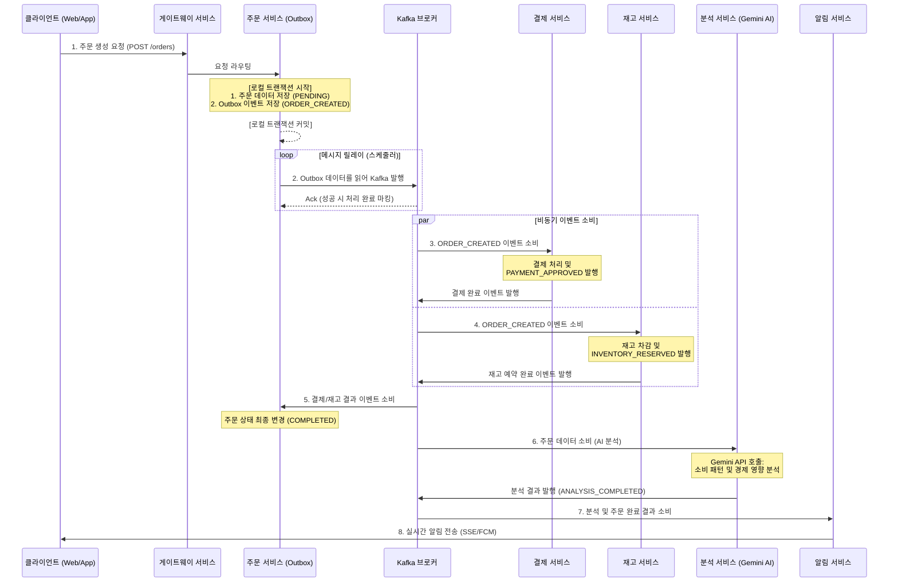

# 물류 MSA 아키텍처 및 구현 가이드

## 1. 시스템 아키텍처 개요
본 프로젝트는 **Spring Cloud**와 **Kafka**를 기반으로 한 이벤트 기반 마이크로서비스 아키텍처(EDA)입니다. 분산 환경에서의 데이터 정합성을 보장하기 위해 **Saga 패턴**과 **Transactional Outbox 패턴**을 핵심으로 채택하고 있습니다.

---

## 2. 서비스 경계 (Service Boundaries)

- **order-service**: 주문 생성 및 주문 상태 관리. `ORDER_CREATED` 이벤트로 Saga를 시작합니다.
- **inventory-service**: 재고 수량 및 예약 관리. 재고 예약 성공/실패 및 해제 이벤트를 발행합니다.
- **payment-service**: 결제 승인 및 취소 처리. 외부 결제 게이트웨이 연동을 담당합니다.
- **delivery-service**: 배송 요청 및 배송 상태 추적.
- **analysis-service**: 주문 및 뉴스 데이터를 Gemini AI로 분석하여 경제 지표 및 소비 패턴 인사이트를 생성합니다.
- **notification-service**: 최종 처리 결과를 Web(SSE) 또는 모바일(FCM)로 사용자에게 알립니다.
- **gateway-service**: 공용 API 라우팅을 담당하며, k3s 환경에서는 Kubernetes 서비스 DNS를 통해 탐색합니다.

---

## 3. Saga 패턴 및 이벤트 흐름 (Choreography 방식)

모든 서비스 간의 트랜잭션은 Kafka를 통한 비동기 이벤트 흐름으로 제어됩니다.

### 상세 시퀀스 다이어그램


### 보상 트랜잭션 (Compensation Flow)
처리 도중 실패가 발생하면 다음의 흐름으로 복구합니다:
`재고 예약 실패 | 결제 실패 | 배송 요청 실패`
  -> **주문 취소(ORDER_CANCELLED)** -> **재고 원복(INVENTORY_RELEASED)** -> **결제 취소(PAYMENT_CANCELLED)**

---

## 4. 핵심 패턴 구현 상세

### A. Transactional Outbox 패턴 (메시지 발행 보장)
DB 업데이트와 Kafka 메시지 발행이 항상 동시에 일어나거나 일어나지 않음을 보장합니다.

```java
@Transactional
public void createOrder(OrderCommand command) {
    // 1. 비즈니스 로직 처리
    Order order = Order.create(command);
    orderRepository.save(order);

    // 2. 같은 트랜잭션 내에서 Outbox 테이블에 저장
    outboxRepository.save(new OutboxEvent(
        "ORDER_TOPIC", 
        order.getId(), 
        "ORDER_CREATED", 
        objectMapper.writeValueAsString(order)
    ));
}
```

### B. Idempotent Consumer (중복 처리 방지)
Kafka에서 동일한 메시지가 두 번 전달되더라도 시스템에 문제가 없도록 멱등성을 보장합니다.

```java
@KafkaListener(topics = "ORDER_CREATED")
public void handleOrder(String payload) {
    String eventId = extractEventId(payload);
    if (processedEventRepository.existsById(eventId)) {
        return; // 이미 처리된 메시지는 스킵
    }
    // 비즈니스 처리...
    processedEventRepository.save(new ProcessedEvent(eventId));
}
```

---

## 5. 인프라 및 실행 방법

### 로컬 실행 (Docker Compose)
```bash
docker compose up --build logistics-postgres kafka redis order-service inventory-service payment-service delivery-service notification-service
```

### k3s 배포 (Kubernetes)
`infra/k8s/logistics/`의 매니페스트를 사용하여 배포하며, 자세한 내용은 `docs/k3s-local-deployment.md`를 참조하세요.

### 모니터링
Grafana와 Loki를 통해 실시간 로그 및 메트릭을 확인합니다.
